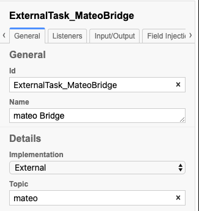
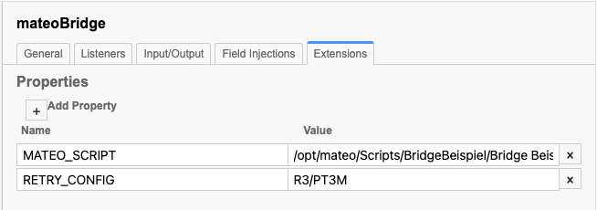
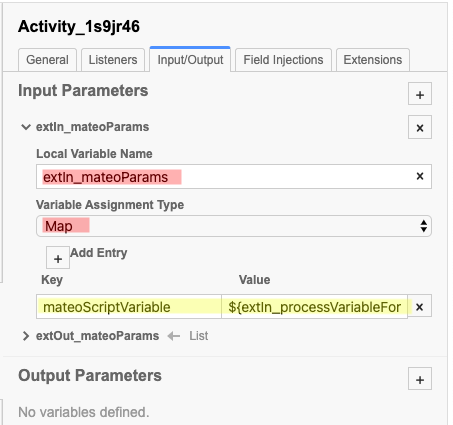
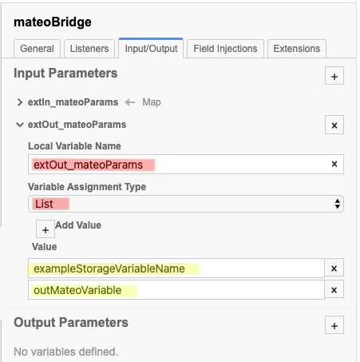

# Mateo Camunda RPA Bridge

Repository für die Mateo-Camunda-Bridge

Die Mateo-Camunda-Bridge ist eine eigenständige Anwendung, die es ermöglicht, mateo-Skripts aus BPMN-Modellen aufzurufen, die in einer Camunda Engine eingesetzt werden.

## Funktionsweise

### Single Mateo Instanz
Die Mateo-Camunda-Bridge dient als Konnektor zwischen Camunda (BPMN) auf der einen und mateo (RPA) auf der anderen Seite. Prozesse, die innerhalb der Camunda-Engine laufen, können externe Tasks definieren, die als RPA-Tasks markiert sind.

Die Bridge erweitert den regulären Java External Task Client, holt und sperrt die RPA Aufgaben und startet ein Skript in mateo. Sobald das Skript erledigt ist, wird der Prozess fortgesetzt. Die hinterlegten Ergebnisvariablen vn mateo werden dabei an die Camunda Engine weitergeben.

### Multi Mateo Instanzen
Desweiteren kann die Mateo-Camunda-Bridge als Konnektor zwischen Camunda (BPMN) auf der einen Seite und dem Mateo-Orchestrator (RPAs) auf der anderen dienen. Die Funktionsweise ist die selbe wie oben, mit dem Unterschied, dass die Skripte zum  (In Progress) übertragen werden werden.

## Voraussetzungen und unterstützte Umgebungen

Um Testskripte von Camunda auszuführen, benötigen Sie:

- Eine laufende mateo Instanz (mind. Version 3.7.3) oder mateo-orchestrator
- Camunda BPM 7.14 Enterprise Edition oder höher

Um ein BPMN-Modell zu entwerfen, das sich über die Bridge mit einem oder mehreren mateos verbindet, sind die folgenden Tools sehr hilfreich (aber nicht erforderlich):
- Cawemo 1.4 oder höher (zum Erstellen und Verteilen von Worker-Katalogen)
- Camunda Modeler 4.2 oder höher (um den Worker-Katalog auf Ihr Prozessmodell anzuwenden)

## Konfiguration

### Mateo-Camunda-Bridge
Die Bridge ist über die Datei application.yml konfigurierbar.

#### Zugriff auf die Camunda API:

Präfix | Eigenschaften | Beschreibung
-------- | -------- | --------
de.viadee.mateo.rpa.camunda-api   | url   | Die URL zur Camunda REST API (z.B. http://localhost:8080/engine-rest)
 " | topic | Der Topicname, welcher am external Task steht
 " | lockDuration | Zeit in Millisekunden zum sperren des External Tasks
 " | lockFactor | Faktor um die sich die Wartezeit erhöht
 " | lockMaxTime | Zeit in Millisekunden, für die der Client ausgesetzt werden kann
 " | initTime | Zeit in Millisekunden, für die der Client nach der ersten Anfrage angehalten wird
 " | authentication.type | Die Art der Authentifizierung für den Zugriff auf die REST-API (z. B. `basic`), nur wenn Ihre REST-API authentifiziert ist
  " | authentication.username | Benutzername
   " | authentication.password | Benutzerkennwort

#### Zugriff auf die mateo API:

Präfix | Eigenschaften | Beschreibung
-------- | -------- | --------
 de.viadee.mateo.rpa.mateo-api  | topic | Der topicname name des External Tasks
 " | type | Typ: `mateo` oder `ochestrator`
 " | url   | Die URL zur mateo/orchestrator REST API (z.B. http://localhost:8123)
 " | errorCode | ErrorCode für BPMN Error Events bei Businessfehlern
 " | authentication.enable | Sollte aktiviert werden, wenn der viadee Roboter genutzt wird.
 " | authentication.username | Username für den Roboter
 " | authentication.password | Passwort für den Roboter

### Einrichten einer RPA-Aufgabe
Die RPA-Bridge ist ein regulärer externer Java-Task-Client und RPA-Tasks sind externe Tasks mit spezifischen Einstellungen.

Die Bridge lauscht auf Tasks mit den definierten Topic `mateo`. Wenn eine Prozessinstanz eine externe Aufgabe mit einem dieser Themen erreicht, kann die Bridge sie abholen und sperren. Sobald eine Aufgabe gesperrt ist, versucht die Bridge, sie an Ihre Installation von mateo oder dem mateo-orchestrator weiterzuleiten, die sich um die Ausführung des zugehörigen Testskripts kümmert.
 

#### Testkript definieren
Um der Bridge mitzuteilen, welches Testkript gestartet werden soll, ist es notwendig, eine Erweiterungseigenschaft (Extensions Properties) mit dem Namen `MATEO_SCRIPT` und einem Wert gleich dem Pfad zum Testkript hinzuzufügen. Zusätzlich kann per `RETRY_CONFIG` das Retryverhalten angegeben werden:

Mögliche Werte sind, default: `R3/PT5M`
- `R1/P1D`: 1 retry after 1 day
- `R2/PT2H`: 2 retries after 2 hours each
- `R3/PT3M`: 3 retries after 3 minutes each
- `PT5M,PT10M,PT20M,PT1H,PT12H,P1D`: 6 increasing retries; 5, 10, 20 minutes, 12 hours, 1 day

 

#### Variablen definieren
Die Variablen die im Testkript zur Verfügung stehen sollen, werden im Tab `Input/Output` unter `Input Parameters` als Map `extIn_mateoParams` angegeben:
 

Die Variablen die aus dem Testskript in den Prozess geschrieben werden sollen, werden im Tab `Input/Output` unter `Input Parameters` als List `extOut_mateoParams` angegeben:
 

Sowohl die Map als auch die List müssen für ein korrektes Feherhandling angegeben werden. Es ist allerdings nicht notwendig Parameter anzugeben.
In jedem Fall wird eine neue Prozessvariable `extOut_mateoScriptResult` erzeugt, welche das Ergebnis des Testskriptes beinhaltet (`Erfolg`, `Warnung`, `NoRun`, `Fehler`, `Abbruch`, `Timeout`, `Unbekannt`).

### BPMN Error
Ein BPMN Error wird geschmissen, wenn
- Das Testskript nicht mit `Erfolg` abgeschlossen wurde
- Ein Fehler beim Lesen der Variablen auftrat
