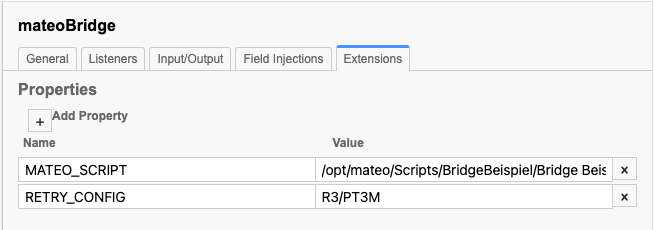

# Mateo Camunda RPA Bridge

Repository for the Mateo-Camunda Bridge

The mateo-camunda-bridge is a standalone application that allows to call mateo-scripts from BPMN models deployed to a Camunda Engine.

## Functionality

### Single Mateo Instance
The mateo-camunda-bridge serves as a connector between Camunda (BPMN) on the one hand and mateo on the other hand. 
Processes running inside the Camunda engine can define external tasks marked as mateo tasks.

The bridge extends the regular Java External Task Client, fetches and locks the mateo tasks and starts a script in mateo. 
Once the script is done, the process continues. The stored result variables of mateo are passed on to the Camunda engine.

### Multi Mateo Instances
Furthermore, the mateo-camunda-bridge can serve as a connector between Camunda (BPMN) and the mateo-orchestrator. 
The functionality is the same as above, with the difference, 
that the scripts are transferred to the [Mateo-Orchestrator](https://github.com/viadee/mateo-orchestrator).

## Prerequisites and supported environments

To run test scripts from Camunda you need:

- A running mateo instance (at least version 3.7.3) or mateo-orchestrator
- Camunda BPM 7.14 Enterprise Edition or higher

To design a BPMN model that connects to one or more mateos via the bridge, 
the following tools are very helpful (but not required):
- Cawemo 1.4 or higher (for creating and distributing worker catalogs)
- Camunda Modeler 4.2 or higher (to apply the worker catalog to your process model)

## Configuration

### Mateo-Camunda-Bridge
The bridge is configurable through the application.yml file that is included in the provided archive. 

#### Access to the Camunda API:
Prefix | Properties | Description
-------- | -------- | --------
de.viadee.mateo.rpa.camunda-api   | url   | The URL to the Camunda REST API (e.g. http://localhost:8080/engine-rest)
 " | topic | The topic name, which is located at the external task
 " | lockDuration | Time in milliseconds to lock the External Task
 " | lockFactor | Factor by which the waiting time increases
 " | lockMaxTime | Time in milliseconds for which the client can be suspended
 " | initTime | Time in milliseconds for which the client is paused after the first request.
 " | authentication.type | The type of authentication for accessing the REST API (e.g. `basic`), only if your REST API is authenticated.
  " | authentication.username | Username
   " | authentication.password | User password

#### Access to the mateo API:

Prefix | Properties | Description
-------- | -------- | --------
 de.viadee.mateo.rpa.mateo-api  | topic | The topicname name of the External Task
 " | type | Type: `mateo` or `ochestrator`
 " | url   | The URL to the mateo/orchestrator REST API (e.g. http://localhost:8123)
 " | errorCode | ErrorCode for BPMN Error Events for Business Errors
 " | authentication.enable | Needs to be activated if the viadee robot is used.
 " | authentication.username | Username for the robot
 " | authentication.password | Password for the robot

### Setting up an mateo task
The mateo bridge is a regular external Java task client and mateo tasks are [external tasks](https://docs.camunda.org/manual/latest/user-guide/process-engine/external-tasks/) with specific settings.

The bridge listens for tasks with the defined topic `mateo`. When a process instance reaches an external task with one of these topics, the bridge can pick it up and lock it. 
Once a task is locked, the bridge will try to forward it to your installation of mateo or the mateo-orchestrator, which will take care of running the associated test script.
 

#### Define test script
To tell the bridge which test script to start, it is necessary to add an [extension property](https://docs.camunda.org/manual/latest/reference/bpmn20/custom-extensions/extension-elements/#properties)
with the name `MATEO_SCRIPT` and a value equal to the path to the test script. Additionally the retry behavior can be specified via `RETRY_CONFIG`:

Possible values are, default: `R3/PT5M`
- `R1/P1D`: 1 retry after 1 day
- `R2/PT2H`: 2 retries after 2 hours each
- `R3/PT3M`: 3 retries after 3 minutes each
- `PT5M,PT10M,PT20M,PT1H,PT12H,P1D`: 6 increasing retries; 5, 10, 20 minutes, 12 hours, 1 day

 

 

#### Define variables
The variables that should be available in the test script are specified in the tab `Input/Output` under `Input Parameters` as map `extIn_mateoParams`:
 

The variables to be written from the test script into the process are specified in the tab `Input/Output` under `Input Parameters` as a 
List `extOut_mateoParams`:
 

Both the map and the list must be specified for correct error handling. However, it is not necessary to specify parameters.
In any case a new process variable `extOut_mateoScriptResult` is created which contains the result of the test script (`Erfolg`, `Warnung`, `NoRun`, `Fehler`, `Abbruch`, `Timeout`, `Unbekannt`).

### BPMN Error
A BPMN Error is thrown if
- The test script was not completed with 'Success'
- An error occurred while reading the variables
